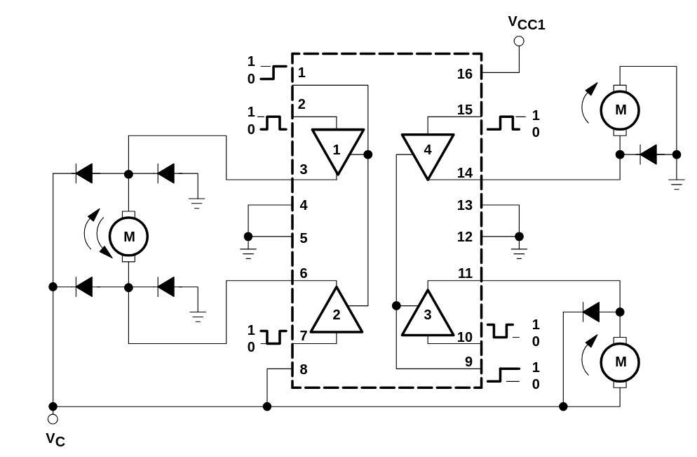
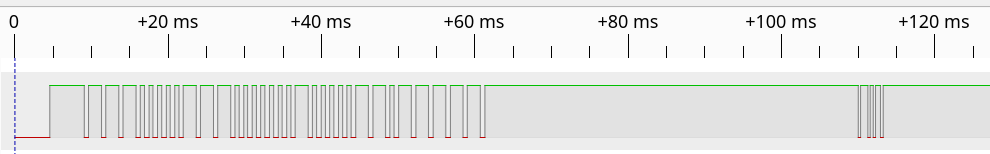
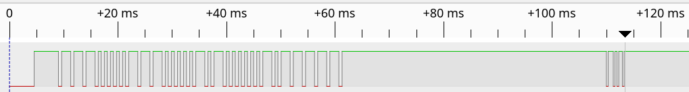
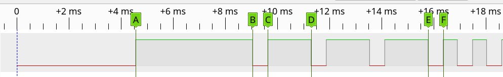
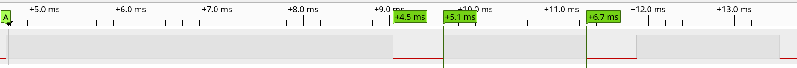
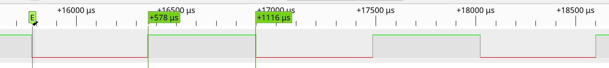
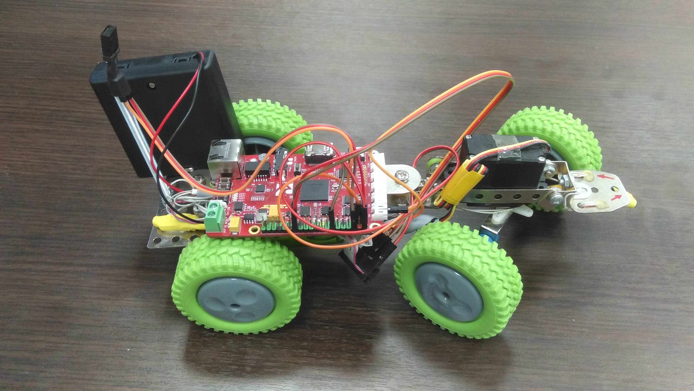
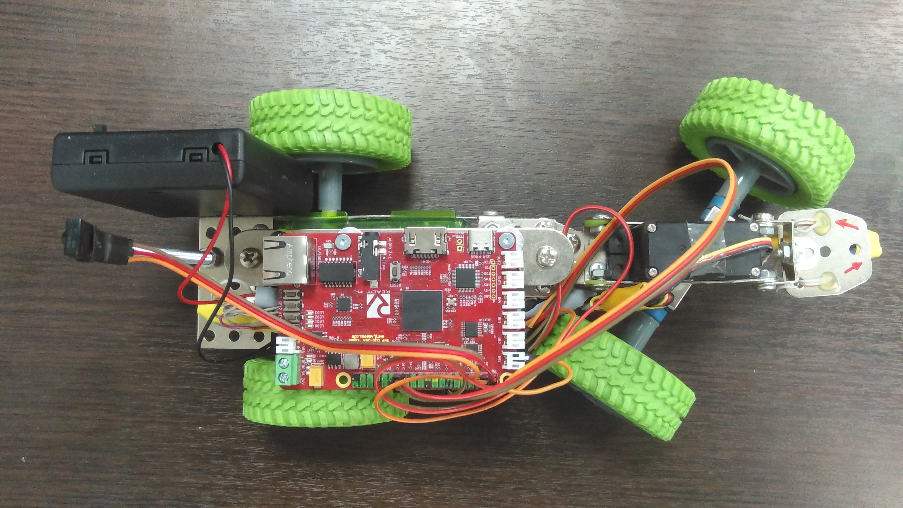

# Тележка управляемая по ИК (IR) от стандартного пульта ДУ

## Цель проекта

Освоение процесса разработки цифровых схем и конечных автоматов на языке Verilog.

## Задача

Разработать конечный автомат на HDL языке Verilog для удаленного управления подвижной тележкой в составе которой имеется:
- один электромотор с редуктором и приводом на задние колёса;
- один H-мост для управления электромотором выполненный на микросхеме [КР1128КТ4](https://eandc.ru/pdf/mikroskhema/kr1128kt4.pdf).
- один серво-привод [Hitec HS-325HB](https://hitecrcd.co.jp/material/spec_sheet/servo/33325.pdf) для поворота передних колес;
- приемник ИК сигнала [TSOP4336](https://static.chipdip.ru/lib/016/DOC029016184.pdf) (36kHz);
- датчик в виде пары ИК светодиод + ИК фотодиода для определения наличия препятствия;
- плата ["Карно"](https://github.com/Fabmicro-LLC/Karnix_ASB-254) с микросхемой ПЛИС Lattice ECP5;
- батарея номинальным напряжением 6В (4xAA).

## Алгоритм

КА в составе ПЛИС принимате входной сигнал от ИК приемника закодированный в формате RC5, SIRC или NEC, декодирует его и в зависимости от полученной команды (нажатой клавиши) выполняет следующие действия:
- если нажата клавиша "вверх", то включает мотор на движение вперед;
- если нажата клавиша "вних", то влючает мотор на движение назад;
- если нажата клавиша "влево", то увеличиывает (или уменьшает) скважность ШИМ сигнала на серво-привода для поворота колес влево;
- если нажата клавиша "вправо", то уменьшает (или увеличивает) скважность ШИМ сигнала на серво-привода для поворота колес вправо;
- если нажата клавиша "RETURN", то производится останов вращения двигателя;
- если с датчика препятствия поступает сигнал выше определенного уровня, то КА останавливает и недопускает движения тележки вперед, при этом движение назад возможно.

### Структура разрабатываемого КА

Конечный автома управления тележкой состоит из следующих более простых КА (модулей):
- модуль декодирования ИК сигнала (ir_decoder);
- модуль формирования сигнала PDM для серво (servo_pdm);
- модуль формирования сигнала ШИМ для электродвигателя (motor_pwm);
- модуль опроса АЦП (adc_capture);
- модуль управления (control).

### модуль формирования сигнала PWM для двайвера электромотора (motor_drv)

Электромотор постоянного тока подключен через драйвер который представляет собой полномостовую схему (H-мост) на базе микросхемы КР1128КТ4 (аналог [L293D](https://users.ece.utexas.edu/~valvano/Datasheets/L293d.pdf)). Для управления направлением и скоростью вращения ротора в драйвере задействовано два сигнала pwm_outA и pwm_outB. Подача ШИМ на сигнал pwm_outA при удержании сигнала pwm_outB в состоянии лог "0" приводит к вращению ротора мотора в прямом направлении с частотой пропорциональной скважности ШИМ. Подача ШИМ на сигнал pwm_outB при одновременном удержании pwm_outA в состоянии лог "0" приводит к врадению ротора в обратно мнаправлении. Подача лог "0" одновременно на pwm_outA и pwm_outB приводит к остановке к закорачиванию обмоток мотора и соответственно к остановке вращения ротора (режим торможения).

Интерфейс модуля имеет следующий вид:

```
module motor_dvr
# (
        parameter  clk_hz       = 25000000,
        parameter  pwm_hz       = 250,
) ( 
	input logic clk,
	input logic enable,
	input logic rst,
	input logic direction,
	output logic pwm_outA,
	output logic pwm_outB
);
```



### Модуль формирования сигнала PDM для серво-привода (servo_pdm)

Станадартные RC-серво управляются шириной импульса, который формируется на её входе с определенной периодичность. Это похоже на ШИМ с апериодичным сигналом и называется Pulse Density Modulation - PDM (в русскоязычной литературе иногда называют "дельта-сигма модуляцией"). 

Серво с таким управлением работает следующим образом:
- При длительности импульса в 1,5 мс серво устанавливает ротор в нулевое (центральное) положение.
- При подаче импульса длительностью меньше чем 1,5мс серво-привод уменьшает угол положения ротора (вращает ротор против часовой стрелки).
- При подаче импульса длительностью больше чем 1,5мс, серво-привод увеличивает угол положения ротора.
- Периодичность следования импульсов - 20мс.


Статья на Wikipedia: https://en.wikipedia.org/wiki/Servo_control

Модуль **servo_pdm** имеет следующий интерфейс:

```
module servo_pdm
# (
        parameter  clk_hz       = 25000000
) ( 
        input  wire       rst,  // Global RESET signal
        input  wire       clk,  // Global Clock
        input  wire       en,   // Enable signal
        input  reg [7:0]  duty, // input Duty cycle value
        output reg        pdm   // produced PDM signal
);

endmodule
```


### Прием и декодирование ИК (IR) сигнала пульта ДУ

Существует множество способов кодирования сигнала для ИК пультов дистанционного управления. Ниже дано краткое описание некоторым из них. В нашей экспериментальной задаче мы будем ориентироваться на ИК пульты от телевизоров Samsung.

#### 1. Sony SIRC Protocol

В аппаратуре производства Sony используется SIRC протокол, в котором логические "0" и "1" закодированны разной длительностью импульса, что предстваляет собой PDM-кодирование.


Описание протокола: https://faculty-web.msoe.edu/johnsontimoj/Common/FILES/sony_sirc_protocol.pdf

#### 2. NEC IR Protocol

Используется PDM-кодирование. Длина посылки - 32 бита.


Описание протокола: https://exploreembedded.com/wiki/NEC_IR_Remote_Control_Interface_with_8051

#### 3. Протокол Samsung

В бытовой технике Samsung используется способ кодирования подобный стандарту NEC. Отличие состоит в том, что данные кодируются длительностью положительного импульса, а не отрицательного. Еще одно отличие - продолжительности импульсов (тайминги) немного отличаются. Так же как и в протоколе NEC, у Samsung-а есть стартовый бит длительностю 4,5 мс, за которым следуют 32 импульса кодирующие 32-х битное командное слово. Слово передается по принципу "от младших битов к старшим" (LSB). Это командное 32-х битное слово делится на две части по 16 бит. Первые 16 бит задают адрес устройства (0x0707 - телевизор), следующие 16 бит - непосредственно команда (или код клавиши). Замечено, что старшие 8 бит адресой части всегда повторяют значение в младших 8 битах. А старшие 8 бит команды посторяют младшие 8 бит команды с инверсией (XOR). Сделано это скорее 1) для проверки корректности принимаемого сигнала и 2) для обхождения патентных ограничений.

Ниже приведена таблица кодов (полные 32 бит) захваченных от ИК пульта телевизора Samsung UE34RU717.

| IR Raw Code | Buttons pressed | IR Raw Code | Buttons pressed |
|-------------|-----------------|-------------|-----------------|
|  0x19E60707 | Power OFF/ON (1)|  0xFB040707 |       1         |
|  0xFD020707 | Power OFF/ON (2)|  0xFA050707 |       2         |
|  0xFE010707 | Signal Source   |  0xF9060707 |       3         |
|  0xF8070707 | Volume +        |  0xF7080707 |       4         |
|  0xF40B0707 | Volume -        |  0xF6090707 |       5         |
|  0xED120707 | Channel +       |  0xF50A0707 |       6         |
|  0xEF100707 | Channel -       |  0xF30C0707 |       7         |
|  0x97680707 | Enter           |  0xF20D0707 |       8         |
|  0x9A650707 | Left            |  0xF10E0707 |       9         |
|  0x9D620707 | Right           |  0xEE110707 |       0         |
|  0x9F600707 | Up              |  0x936C0707 |       A         |
|  0x9E610707 | Down            |  0xEB140707 |       B         |
|  0x29D60183 | Return          |  0xEA150707 |       C         |
|  0xD22D0707 | Exit            |  0xE9160707 |       D         |
|  0x86790707 | Home            |  0xB9460707 |     Stop        |
|  0xF00F0707 | Mute            |  0xB8470707 |     Play        |

PS: Кнопка Power Off генерирует последовательно два кода: сначала дава или три раза следует код 0x19E60707, заме посылка завершается одним кодом 0xFD020707.

Ниже приведены скриншоты захватенного сигнала с ИК пульта от телевизора Samsung UE34RU717.


Общая форма IR сигнала - 32 бита команда "нажата клавиша 1" + указатель повтора.



Общая форма IR сигнала - 32 бита команда "нажата клавиша 2" + указатель повтора.



Расположение маркеров на IR сигнале.



Форма стартового бита - 4,5 мс и форма лог "1" - 1,1 мс.



Форма лог "0" - 0,54 мс.


### Датчик препятствия и АЦП

В качестве датчика препятствия у нас используется пара ИК светодиод + ИК фотодиод сонаправлено установленные спереди тележки. ИК светодиод выдает излучение в инфракрасном спектре которое хорошо отражается от препятствий и возвращается обратно. Этот отраженный сигнал поступает на ИК фотодиод, который формирует на своих электродах напряжение фото-ЭДС пропорциональное интенсивности отраженного сигнала. Чем ближе препятствие, тем выше интенсивность отраженного сигнала, тем больше фото-ЭДС. Именно эту фото-ЭДС мы собираемся измерять с помощью АЦП, анализировать и вычислять по ней интенсивность отраженного сигнала, приблизительно оценивать расстояние до препятствия и формировать управляющее воздействие (останавливать движение тележки вперед).

Опытным путем было установлено, что фото-ЭДС формируемая ИК фотодиодом варьируется от 0 до 2,5 В в зависимости от расстояния до препятсвия. Это попадает в диапазон рабочих няпряжений АЦП, а значит можно соединить выход фотодиода с входом АЦП напрямую без предварительного усиления.

В качестве АЦП будем использовать микросхему [ADC128S052](https://static.chipdip.ru/lib/827/DOC031827742.pdf) установленную на плате "Карно" и подключенную к микросхеме ПЛИС.

## Ссылки

1. Статья на Хабре "[IR remote control, а без микроконтроллеров можно? Да не вопрос](https://habr.com/ru/companies/timeweb/articles/784500/)"
2. Статья на Wikipedia "[RC-5 Protocol](https://en.wikipedia.org/wiki/RC-5)"
3. Cтатья "[Система ИК ДУ с кодированием](https://radiostorage.net/512-sistema-ik-du-s-kodirovaniem.html)"
   
## Фото




